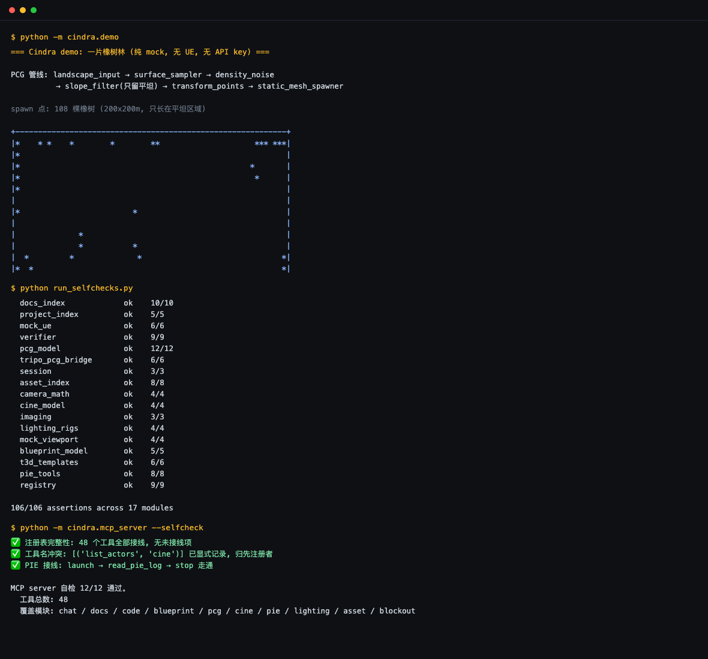

[](README.md)
[](https://github.com/JediKinght9527/ue5-ai-commander/actions/workflows/self-check.yml)
[](https://docs.astral.sh/uv/)
[](LICENSE)

# ue5-ai-commander

Natural-language control for Unreal Engine 5.7. **48 MCP tools**: scene editing, PCG procedural generation, Blueprints, C++, engine Q&A, cinematics, lighting, PIE automation. Works with Claude Code / Cursor.

**Runs without UE** — the mock backend verifies the whole pipeline on any machine, with no engine and no API key.

<p align="center">
  
</p>

That forest came from one PCG pipeline (landscape → sampler → flat-only filter → random transform → spawn) scattering 141 oaks across a 200×200 m terrain, flat ground only. Three commands, fully mocked.

<p align="center">
  
  <br>
  <sub>Actual output, not a mock-up — 106 module assertions + 12 MCP assertions green, all 48 tools wired</sub>
</p>

---

## install

```bash
git clone https://github.com/JediKinght9527/ue5-ai-commander.git
cd ue5-ai-commander
uv sync --frozen --extra dev      # or: pip install -e .
```

Runs on the standard library alone; `anthropic` is the only runtime dependency and is only needed for the Claude API.

## usage

### MCP (recommended)

Add to Claude Code `settings.json`:

```json
{
  "mcpServers": {
    "ue5": {
      "command": "uv",
      "args": ["--directory", "/path/to/ue5-ai-commander", "run", "python", "-m", "cindra.mcp_server"]
    }
  }
}
```

Then just say what you want: `scatter 100 oaks on flat ground only, keep them off the slopes`.

### CLI

```bash
uv run --frozen python -m cindra.cli --once "place three cubes in a ring"
uv run --frozen python -m cindra.cli --mode pcg --once "build a race track"
```

### Real UE 5.7

See [WINDOWS_SETUP.md](WINDOWS_SETUP.md). Switch `--backend ue` — tool schemas and agent logic stay byte-identical.

## modules

| Module | What it does | Example |
|---|---|---|
| Chat | scene editing | "make a ring of 10 trees with a rock in the middle" |
| Docs | engine Q&A (RAG) | "difference between Actor and Pawn" |
| Code | project-style C++ | "add a dash ability to the character" |
| Blueprint | assembles graphs | "print hello on BeginPlay" |
| PCG | procedural generation | "oaks on flat ground only, nothing on slopes" |
| Cine | camera moves | "slow push from high above onto the hero" |
| PIE | launch / read log / stop | "run it and tell me if it errors" |
| Lighting | styled rigs | "switch to horror lighting" |
| Asset | search and place | "put the crate on the table" |
| Blockout | greybox levels | "build a sniper alley" |

All ten share one agent loop and the same mock/real backends.

## tool list

```
Chat (11)        spawn_actor, spawn_grid, delete_actor, move_actor,
                 set_transform, arrange_scene, inspect_viewport, undo,
                 list_actors, clear_scene, spawn_asset

Docs (2)         search_docs, list_topics

Code (2)         search_project, list_symbols

Blueprint (11)   create_blueprint, compile_blueprint, list_node_types,
                 add_node, add_variable, connect_pins, delete_node,
                 list_graph, clear_graph, list_blueprint_templates,
                 inject_blueprint_t3d

PCG (9)          list_pcg_node_types, add_pcg_node, connect_pcg_pins,
                 set_pcg_param, delete_pcg_node, list_pcg_graph,
                 run_pcg_graph, inspect_pcg_result, clear_pcg_graph

Cine (7)         create_sequence, add_cinematic_camera, camera_move,
                 render_sequence, review_render, list_sequence,
                 inspect_viewport

PIE (3)          launch_pie, stop_pie, read_pie_log

Lighting (1)     light_rig (5 styles: horror/golden_hour/studio/
                 night_neon/overcast)

Asset (1)        search_assets

Blockout (1)     generate_blockout (5 templates: combat_arena/
                 sniper_alley/choke_point/boss_room/race_track)
```

**48** in total. Blueprint T3D injection drops a whole subgraph at once (7 templates like BeginPlay→Print, Branch→dual print) instead of add→connect node by node.

PIE loop: `launch_pie` → `read_pie_log` → fix what's wrong → run again.

## verification

No UE, no API key, works anywhere:

```bash
uv run --frozen python run_selfchecks.py            # 17 modules / 106 assertions
uv run --frozen python run_selfchecks.py mcp_server # MCP layer / 13 assertions
uv run --frozen python -m cindra.demo --check        # demo reproducibility / 3 assertions
```

Any single module runs on its own too:

```bash
python -m cindra.docs_index          # 10/10
python -m cindra.project_index       # 5/5
python -m cindra.mock_ue             # 6/6
python -m cindra.verifier            # 9/9
python -m cindra.pcg_model           # 13/13
python -m cindra.tripo_pcg_bridge    # 6/6
python -m cindra.session             # 3/3
python -m cindra.asset_index         # 8/8
python -m cindra.camera_math         # 4/4
python -m cindra.cine_model          # 4/4
python -m cindra.imaging             # 3/3
python -m cindra.lighting_rigs       # 4/4
python -m cindra.mock_viewport       # 4/4
python -m cindra.blueprint_model     # 5/5
python -m cindra.t3d_templates       # 6/6
python -m cindra.pie_tools           # 8/8
python -m cindra.registry            # 9/9
python -m cindra.mcp_server --selfcheck  # 13/13
```

CI runs every assertion on **ubuntu + macos × py3.11 + py3.12**, plus `ruff`, `pyright`, and a wheel build check.

## design

### mock first

Each module has an in-memory mock: scenes are dicts, blueprints are graph nodes, PCG is point-cloud maths, viewports are rendered PNGs. Mock green → swap the transport → same code inside real UE.

### verification loop

Snapshot before and after every edit and diff them. A tool that returns ok while nothing changed in the engine is caught, rewritten to `VERIFY FAILED`, and the screenshot is fed back so the agent can fix it.

### determinism

All randomness goes through `md5(seed|salt)` rather than `random` — the same graph grows the same forest on any machine. Change `global_seed` and the whole graph regrows.

### multi-model

See [COMMAND_RUNNERS.md](COMMAND_RUNNERS.md).

## layout

```
cindra/        44 modules: mcp_server / registry / pcg_model / blueprint_model /
               scene_tools / verifier / pcg_verifier / mock_ue / transport / ...
ue_plugin/     helpers injected into the UE editor side
check_ue.py    staged real-UE connectivity diagnosis (needs Windows + UE)
run_selfchecks.py  run every module self-check in one command
docs/          announcement copy
```

## contributing

See [CONTRIBUTING.md](CONTRIBUTING.md) — verification commands, commit rules, and the domain rule that matters most here: *a parameter must either work or not be exposed.*

Security: [SECURITY.md](SECURITY.md). Changelog: [CHANGELOG.md](CHANGELOG.md).

## license

[MIT](LICENSE)
